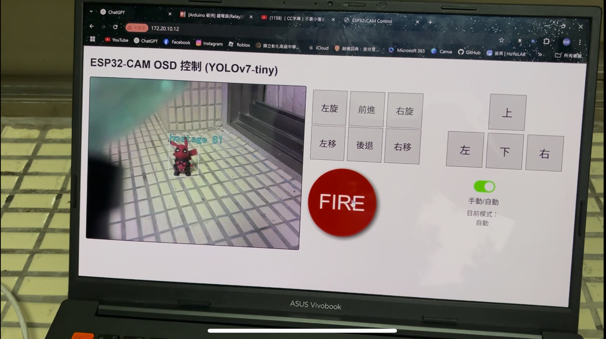
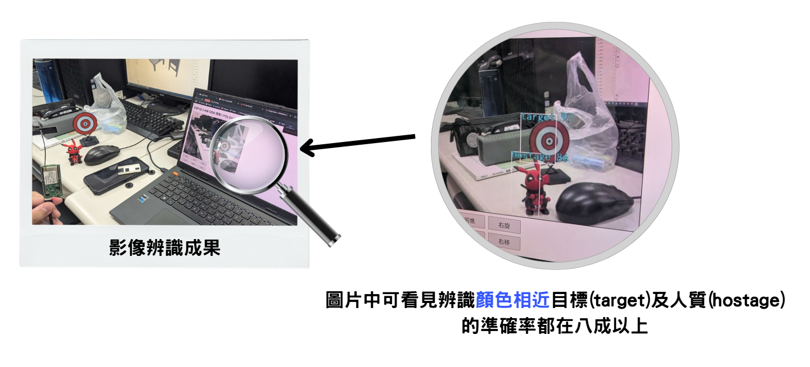

# RTL8735U 智慧自走車專案 🚗🤖

本專案以 **Realtek RTL8735U (HUB 8735U)** 為核心，打造一台具備 **遠端遙控** 與 **智慧自主** 雙重功能的無人自走車。  
系統整合 **四輪麥克納姆輪移動控制**、**RTSP 即時影像串流**、**YOLOv7-tiny 目標辨識**、**自動/手動伺服砲台瞄準**，以及 **人質偵測安全鎖定機制**。  
最終能在瀏覽器上即時操作，達成「即裝即用」的全方位演示平台。  

---

## 🔑 功能特色
- **四輪麥克納姆輪**：支援前進、後退、橫移、原地旋轉。  
- **Web 瀏覽器控制**：免安裝 App，只需輸入 IP 即可操作。  
- **即時 RTSP 串流**：低延遲影像回饋，畫面同步更新。  
- **YOLOv7-tiny 物件偵測**：即時標記與辨識目標。  
- **伺服砲台 (Pan/Tilt)**：可手動遙控或自動瞄準。  
- **人質偵測安全機制**：畫面中若出現平民/友軍，禁止開火。  

---

## 🛠 系統架構

---

---

## 🚀 使用方法
1. 將 `src/` 中程式燒錄至 RTL8735U 開發板。  
2. 修改程式中的 Wi-Fi 帳號密碼。  
3. 上電後開發板自動連線 Wi-Fi。  
4. 在瀏覽器輸入板子 IP → 進入 Web 控制介面。  

---

## 📸 成果展示
### 即時控制畫面

### YOLOv7-tiny 偵測成果

---

## 📚 學習內容
- 嵌入式系統開發  
- 車體設計與電路整合  
- 伺服馬達控制技術  
- 即時影像串流處理  
- YOLOv7-tiny AI 影像辨識  
- Web 控制介面設計  
- 系統整合與測試  

---

## 🙌 貢獻與授權
- 作者：`[你的名字]`  
- 指導老師：`[老師名字]`  
- 授權方式：MIT License / 學術用途（可依需求修改）  

